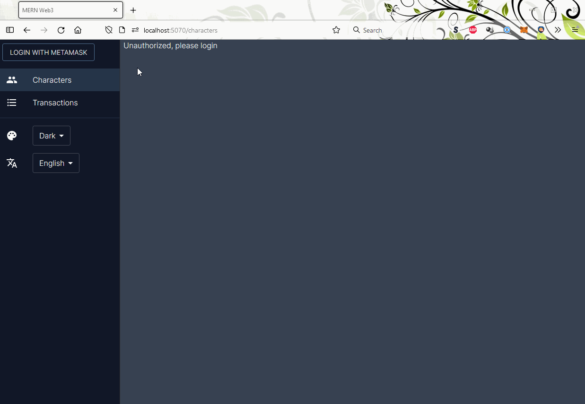

# machinellama/MERN-Web3

Quickly create a simple MERN stack application with key features pre-built and ready to run.
Includes web3 login/authentication using MetaMask and Ethereum!

To run: `yarn install` and then `yarn start` to start the interactive CLI
- Node and Yarn are required prerequisites
- If using Mongo, make sure to download MongoDB, install, add bin folder to path, and run with `mongod` in a separate terminal

## CLI
Running start will begin the CLI, which will ask for a new project name, whether you want both frontend and backend components, and ports for each. You can enter new values or press Enter for each question to accept default values.

Note: only a few questions are asked in the CLI; full configuration is in `config.js` (see below)

After answering questions:
- A script will copy Webpack, Babel, Express, and React files to a new directory
- Necessary dependencies will be installed via Yarn
- The newly created React App can be run with `yarn run dev:web` (on port 5070 by default)
- An Express server can be run by running `yarn run dev` (on port 4070 by default)
- If you opted to only include frontend or backend components, the run command will just be `yarn run dev` for the one included

## Demo of app created



## Features
- ReactJS
  - Functional components
  - React Routing
  - Framework for translations and themes
- Material UI
- TailwindCSS
  - With light and dark themes
  - Compilied with PostCSS
- MongoDB
- Express
  - Example GET and POST endpoints
- Authentication
  - Uses web3 and MetaMask wallet address for login (no username/password required)
  - You can find the backend web3 auth logic [here](https://github.com/machinellama/mern-web3/blob/main/templates/express/api/users/users.service.ts) and the frontend MetaMask logic [here](https://github.com/machinellama/mern-web3/blob/main/templates/src/components/navigation/Navigation.tsx#L65)
- TSOA
  - TypeScript based MVC framework for REST endpoints
- Webpack
  - TypeScript, JavaScript, and SASS compilation
  - File resolution aliases
- Babel
  - ES compilation
- Prettier
  - Auto runs on commit using husky and lint-staged

## Config (defaults can be changed in `config.js`)
```js
config = {
  entryFile: './src/index.tsx',
  webpack: {
    htmlFilename: 'index.html',
    htmlTemplate: './public/index.html',
    openOnStart: true,
    outputFile: 'bundle.js',
    outputPath: 'dist',
    port: 5070
  },
  package: {
    author: 'author_name',
    description: 'This is a default description',
    license: 'MIT',
    projectName: 'new-project',
    repositoryType: 'git',
    repositoryURL: 'repository_url',
    version: '0.0.1'
  },
  manifest: {
    backgroundColor: '#ffffff',
    description: 'This is a description for the new project',
    display: 'fullscreen',
    icons: '[]',
    name: 'New Project Name',
    orientation: 'portrait',
    shortName: 'New Project Short Name',
    startURL: '/',
    themeColor: '#ffffff'
  },
  meta: {
    description: 'This is the meta description for the new project'
  },
  express: {
    port: 4070,
    url: 'http://localhost'
  },
  mongo: {
    port: '27017',
    url: 'mongodb://localhost'
  }
}
```

## Donate
If you found this repo helpful and would like to donate, every bit helps!

- BTC: bc1qr597jpxajrr5y32xxy9s90djwe27duug9jgvw5
- ETH: 0x2c167e7C96a04218361197e1caADb1F9813c5cd9
- DOGE: DMpw1DapRxRJoSJMA3rPWspggXQUXLwtnm
